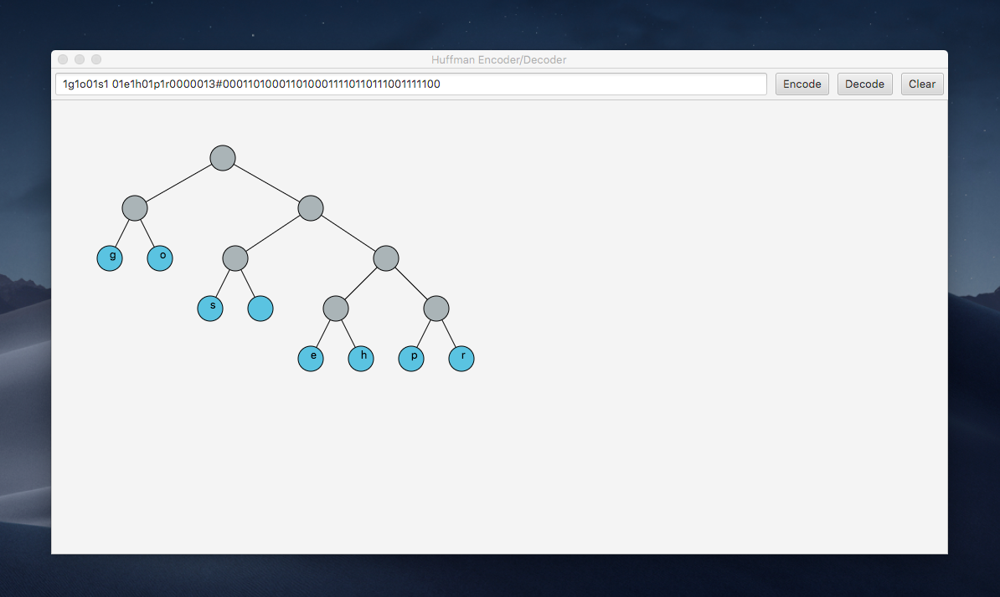

# CSCI-651 Algorithm Concepts: Programming Assignment 1

## Members: [Tom Pang](https://www.github.com/tpang29), [Jay Shah](https://www.github.com/Jay9596), [Efosa Uwa-Omede](https://www.github.com/euwaomed)

## Programming Assignment:

In this programming assignment, the goal was to write a program that takes in a sentence and generates the Huffman tree specified by the header. A program was designed and implemented that widely uses Huffman coding algorithm, which is used in JPEG compression as well as in MP3 audio compression. Concepts that were learned from the class, namely priority queues, stacks, and trees, were utilized to design the file compression program and the file decompression program (similar to *zip* and *unzip*).

### Languages & Technologies used:

- Java
- JavaFX (GUI)

### Steps to Run:

- Java SDK (9 or higher)
- JavaFX SDK required
- Clone repo
- Opein in preferred IDE
- Add JavaFX to the project
- Run and enjoy!

### Learn more:
If you are curoious about how each file works together to encode/decode messages, go [here](CODING.md).

# Screenshots:

